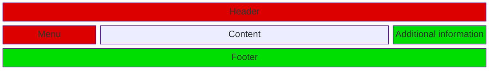

A note about these series. It appears that [Giorgio Sironi](https://giorgiosironi.blogspot.com/) and I had the same idea regarding Design Patterns and blogging about them. He covers the [Singleton](https://giorgiosironi.blogspot.com/2010/01/practical-php-patterns-singleton.html) design pattern thoroughly in his blog post, which is recommended reading.

## The Problem

When I started programming in PHP I was faced with creating a simple database driven web page for a Ferrari Fans Fun Forecast Club. The page had 5 different sections that each accessed the database to retrieve data. Each section was included in more than one page and only the menu, header and footer were common in all pages.

My first design and implementation was horrible. I still have the files and for the purposes of this blog post I went back and checked on them and I can safely say I am ashamed of that code. But then again we all start from somewhere so that was my start and more importantly I do not program like that any more. The picture below shows how the page was constructed:


Each of the sections was a different php script (`header.php`, `menu.php`, `content.php`, `footer.php`, `info.php`) and in order to retrieve information from the database for each section I had the following snippet at the top of each script:

```php
$dbName = 'FFFF';
$dbUser = 'ffff_user';
$dbPass = 'mypassword';
$dbHost = 'localhost';

$conn = mysql_connect($dbHost, $dbUser, $dbPass);
if (!$conn) {
    die(('Cannot connect to the database :' . mysql_error());
}

$db = mysql_select_db($dbName, $conn);
if (!$db) {
    die ('Cannot select the database : ' . mysql_error());
}
```

Some might comment on my error handling or the naming of the variables. That is not the problem. The problem is that the snippet of code above was used in **every script file** (all 5 of them). As a result every page load was hitting the database 5 times. Although the intended user base was no more than 100 people, due to this design flaw I had the equivalent of 500 users.


## The first step - Primitive refactoring

You might argue that the two files (header, menu) can easily be combined into one (and the same with additional information and footer) and that will save me 3 connections. The layout does not change but now each of the shaded areas represent one script:



Although this is a good start it is not the solution to the problem. I have effectively reduced the number of hits to 3 per visitor (300 vs 500 before). The goal is to have one connection per visitor.

## One step further - A global variable

I need to create the database connection, store it in a global variable, and then let the rest of the scripts access that variable - and subsequently the database connection - when needed. The pseudo code is as follows:

* Load script `header.php`
* Get the database credentials
* **Create a database connection**
* Select the database
* Display the data
* Load script `content.php`
* **Create a database connection**
* Display the data
* Load script `footer.php`
* **Create a database connection**
* Display the data

I need to ensure that my database connection is initiated at the beginning of every page. The script header.php is the most obvious place:

```php
$dbName = 'FFFF';
$dbUser = 'ffff_user';
$dbPass = 'mypassword';
$dbHost = 'localhost';

$DBconn = mysql_connect($dbHost, $dbUser, $dbPass);
if (!$DBconn) {
    die(('Cannot connect to the database :' . mysql_error());
}

$db = mysql_select_db($dbName, $DBconn);
if (!$db) {
    die ('Cannot select the database : ' . mysql_error());
}
```

In every script thereafter I need to reference the global variable and I can then use it in that script:

```php
global $DBconn;
```

Although this is an "acceptable" way of programming, maintaining all the global variables can easily be a nightmare for

* maintenance
* testing
* quality control
* any part of the code in any script that references this global variable can effectively change that variable
* that the code will look "ugly" (hey I am proud of the code that I write :))

## Design Patterns - Singleton

A better approach to solve this problem is to use a design pattern. In this case I will use the Singleton Pattern.

The Singleton pattern is applied to a class which when called will create a database connection if the connection does not exist or pass the connection back to the caller if it has already been instantiated. This way I really do not care where the database credentials will be added and when the connection will be instantiated. The first time that I am calling the class that implements the Singleton pattern will connect to the database and have the connection stored ready to be used. The pseudo code is as follows:

* Load script `header.php`
* Get the database credentials
* **Create a database connection**
* Select the database
* Display the data
* Load script `content.php`
* **Get the database connection**
* Display the data
* Load script `footer.php`
* **Get the database connection**
* Display the data

The class that I created is as follows:

```php
class Db
{
    private static $_db   = null;
    private static $_conn = null;

    private function __construct()
    {
        // This is where we have the connection parameters
        include_once 'connection.inc.php';

        $this-&gt;_conn = mysql_connect($host, $user, $password);
        if (!$this-&gt;_conn) {
            throw new Exception('Cannot connect to the database :' . mysql_error());
        }

        $db = mysql_select_db($database, $this-&gt;_conn);
        if (!$db) {
            throw new Exception('Cannot select the database : ' . mysql_error());
        }
    }

    private function __destruct()
    {
        mysql_close($this-&gt;_conn);
    }

    // The singleton method
    public static function getInstance()
    {
        if (null === self::$db) {
            self::$_db = new Db($options);
        }

        return self::$_db;
    }

    public function query($sql)
    {
        $_result = mysql_query($sql);

        if (!$_result) {
            throw new Exception('Error in query : ' . mysql_error() . "\n" . $sql);
        }

        $data = array();

        while ($row = mysql_fetch_assoc($_result)) {
            $data[$row['id']] = $row;
        }

        mysql_free_result($_result);

        return $data;
    }
}
```

With this class available I really do not care if my database connection code is at the beginning of my scripts or not. Using this class allows me to create the database connection (if it is not established) and persist/reuse it further down the script execution.

The code for my header and menu (see graphic above) becomes:

```php
    $sql = 'SELECT menu_id, menu_name FROM tbl_menu';
    $menu = Db::getInstance()->query($sql);
```

while the one for the rest of the site is exactly identical sans the query to be executed. The problem is solved (I now have one connection per visitor) and the code seems a lot tidier.

Note that the connection parameters are in a separate file which is accessed during the `__construct()` method of the class. You can use anything you want to supply these parameters in your class.

## Conclusion

The Singleton Design Pattern is a blessing in disguise. If the ground work has not been done (i.e. create tests for your code and thoroughly document it) then it is difficult for a new developer coming into a project to understand what is going on, especially when the new developer needs to make alterations and run newly created tests.

A word of caution: If you choose to use this pattern in your application, make sure that everything you do is thoroughly documented and tested. This will make your life a lot easier in the long run and will aid in maintenance.

**Update**: Thanks to [Jani Hartikainen](https://codeutopia.net/) for pointing out an error in the code.
